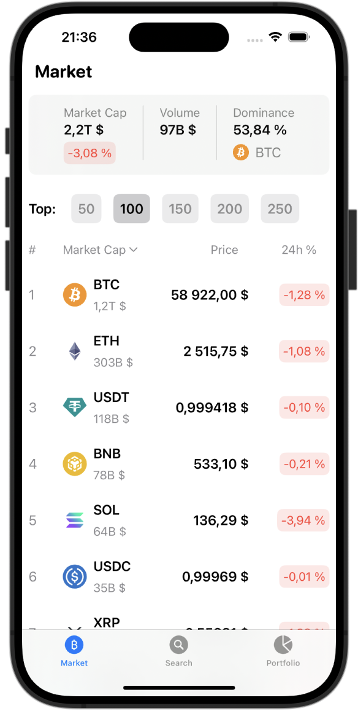
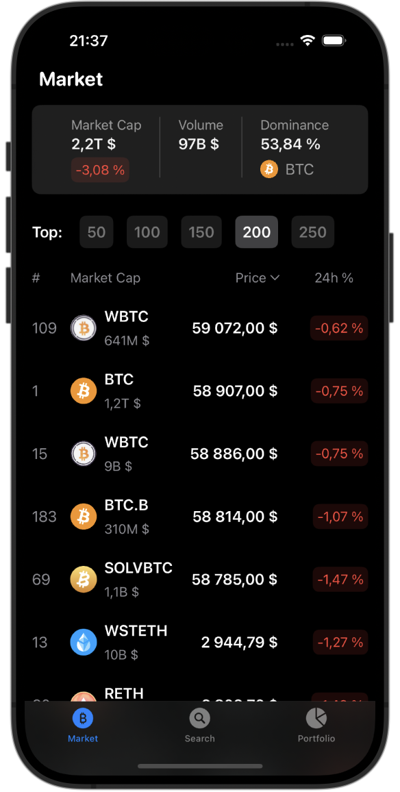
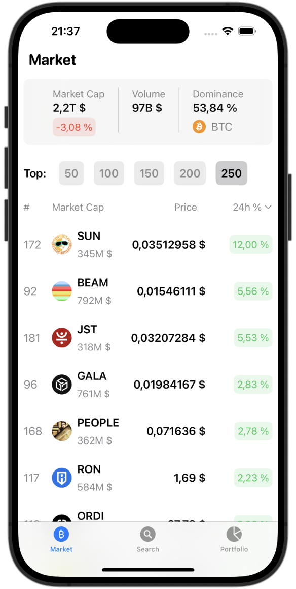
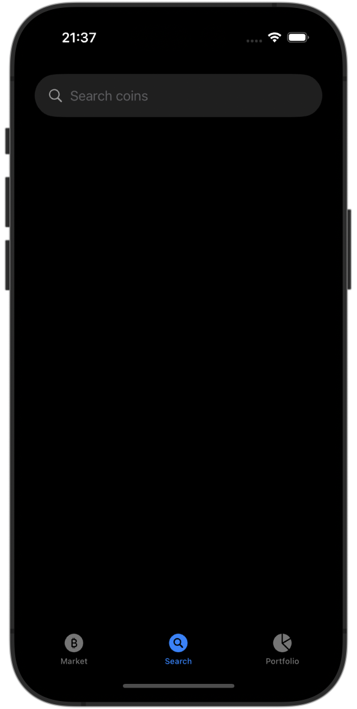
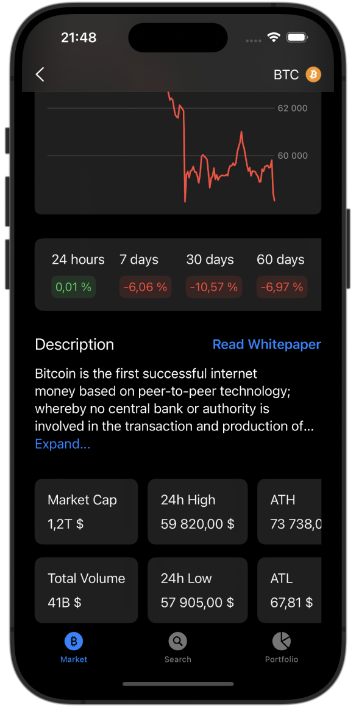
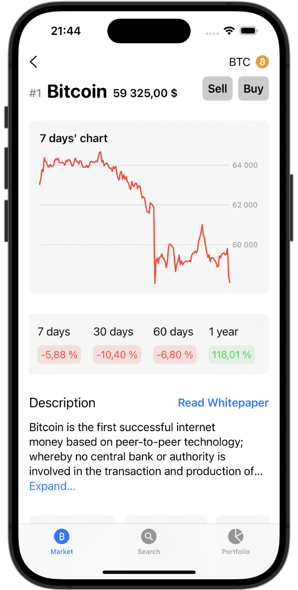

# Crypto App 📱

Crypto App is an iOS application that allows users to stay updated with the latest cryptocurrency market data. The app provides a comprehensive list of features including viewing market data, managing a personalized portfolio, and in-depth analysis of individual coins.

## Features 🚀

- **Market Overview**: View current market data, including market cap, total volume, and Bitcoin dominance.

<details>
    <summary>Screenshots of market overview</summary>
    
    
</details>

- **Coins List**: Access a comprehensive list of cryptocurrencies.
  - **Customize List**: Choose the number of coins to display in the list.
  - **Sort Coins**: Sort the coins by market cap rank, market cap, price, and 24-hour percentage change.

<details>
    <summary>Screenshots of sorting the list and selecting the number of coins</summary>
    
    
</details>

- **Search Functionality**: Quickly search and find a specific cryptocurrency by name or symbol.

<details>
    <summary>Screenshots of search view</summary>
    
    
    
    
</details>

- **Coin Details**: View detailed information about each cryptocurrency, including price, market cap, volume, and more.

<details>
    <summary>Screenshots of detail coin view</summary>
    
    
    
    
</details>

- **Portfolio Management**: Add and remove coins from your personalized portfolio.

<details>
    <summary>Screenshots of portfolio view</summary>
    
    
</details>

## Technologies Used 🌐

- **Swift**: The core programming language used for developing the app.
- **SwiftUI**: Utilized for building the user interface, providing a modern and declarative approach to UI design.
- **CoreData**: Employed for persistent data storage, allowing the app to save and manage portfolio data locally.
- **GCD (Grand Central Dispatch)**: Used for handling asynchronous tasks, ensuring smooth performance and a responsive user experience.
- **URLSession**: Handles network requests to fetch real-time cryptocurrency data from APIs.
- **CoinGecko API**: The app retrieves cryptocurrency data from the CoinGecko API, which provides comprehensive market information.

## Architecture 🏗️

The app is structured using the **MVVM (Model-View-ViewModel)** architecture, which separates the concerns of data management, user interface design, and business logic. This architecture ensures a clear and maintainable codebase, making it easier to manage and scale the application.

### MVVM Breakdown:

- **Model**: Represents the data layer of the app, including data fetched from APIs and CoreData storage.
- **View**: The user interface components built using SwiftUI.
- **ViewModel**: Acts as the intermediary between the Model and View, handling the business logic and preparing data for display.

## Setup Instructions ⚙️

1. **Clone the Repository**: 
   ```bash
   git clone https://github.com/soldansd/CryptoTracker
2. **You should have Coin Gecko Public API Key**
    
    [Get API Key](https://www.coingecko.com/en/api)
    
    - Click "Get your API key now"
    - Than "Create your demo account"
    - After that follow the [article](https://docs.coingecko.com/v3.0.1/reference/setting-up-your-api-key)
    
3. **Create "APICredentials.swift" file in CryptoTracker folder**
    ```swift
    import Foundation
    
    enum APICredentials {
       static let API_KEY = "Your API Key"
    }
